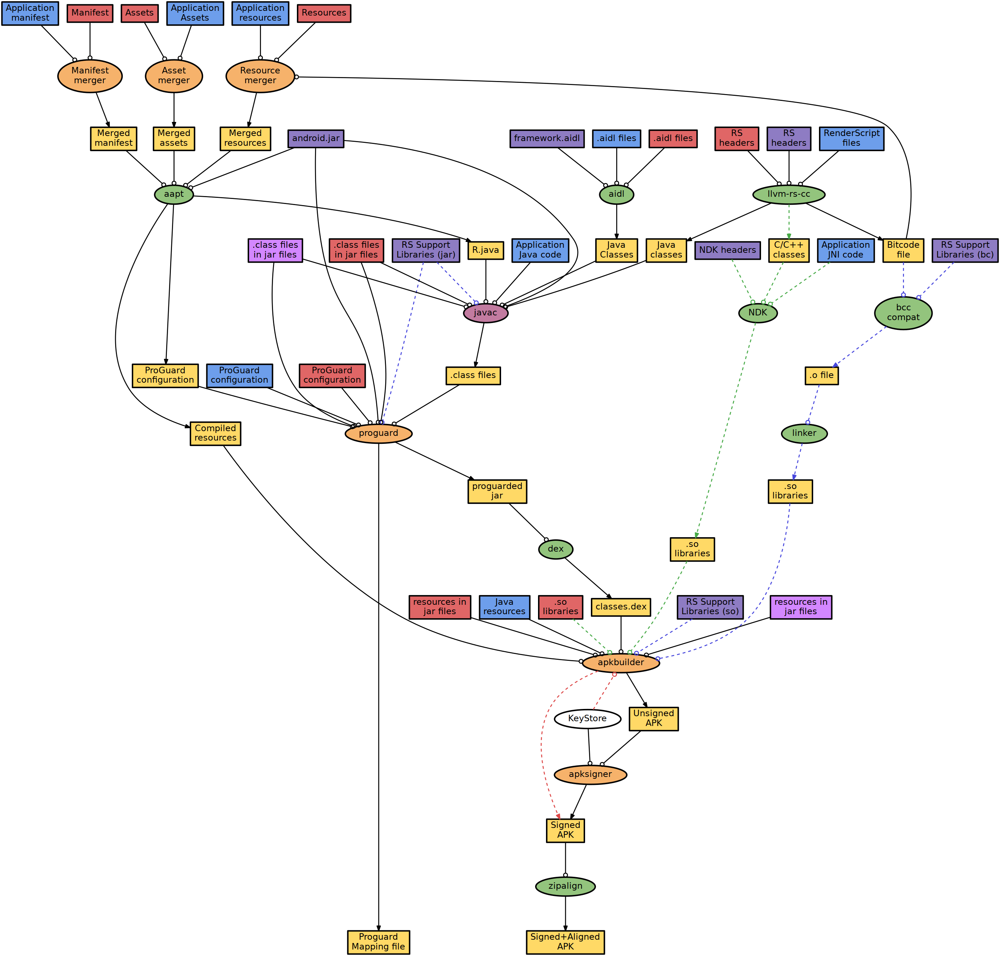

# Build Diagram for Android 

This repository contains a graph representation of a typical Android build using the Android Plugin for Gradle. 

It is **currently INCOMPLETE** and is missing such things as: kotlin, kapt, annotation processing, vector drawable rendering, jacoco, desugar, instant run, d8, the new apksigner that does zipalign, the different transform pipelines, the incremental dexing steps, legacy multi-dex, and more...

Requirements: m4 for text processing and graphviz for graph rendering.
You can install both on Debian/Ubuntu with:
``` shell
sudo apt-get install m4 graphviz
```

To render the diagram from the template:
``` shell
m4 build-diagram.dot.m4 | dot -Tpng -o build-diagram.png
```

You can also substitute [other formats](https://www.graphviz.org/doc/info/output.html) such as "svg", "pdf", "jpg" for "png".

## Diagram preview



## Disclaimer
**This is not an official Google product.**

## Copyright
Copyright 2018 Google LLC
